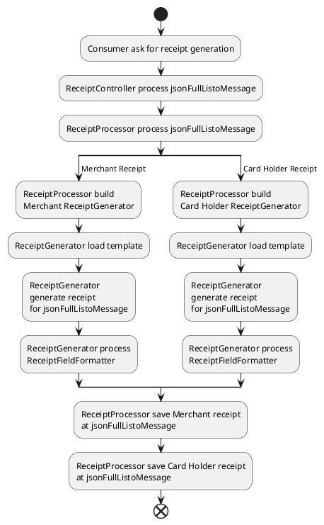

# Listo Sub-Acquirer System Documentation

The purpose of this document is to provide an overview of the Listo Sub-Acquirer System to a developer. It is assumed that the reader has a minimal understanding of a transaction flux for a payment institution and a system developer knowledge.

| Writer                | Date       | Version |
| :-------------------- | :--------: | ------: |
| Willian Beralde Bispo | 20/09/2019 | 1.0     |

## Índice

- [Listo Sub-Acquirer System Documentation](#listo-sub-acquirer-system-documentation)
  - [Índice](#%c3%8dndice)
  - [Overview](#overview)
  - [Architecture](#architecture)
  - [Services](#services)
  - [Message Basic Flux](#message-basic-flux)
        - [Request Input](#request-input)
        - [Request Processing](#request-processing)
        - [Send to the Acquirer](#send-to-the-acquirer)
        - [Reply Processing](#reply-processing)
        - [Reply Output](#reply-output)
  - [Developer Notes](#developer-notes)
    - [Libs, Frameworks and Dependencies](#libs-frameworks-and-dependencies)
      - [Java](#java)
      - [C.Sharp](#csharp)
    - [Service Contract](#service-contract)
    - [Controllers](#controllers)
    - [Logging](#logging)
    - [Database](#database)
  - [Configuration Files](#configuration-files)
  - [Services Detailing](#services-detailing)
    - [Communication Service](#communication-service)
    - [Channel Message Service](#channel-message-service)
    - [Acquirer Message Service](#acquirer-message-service)
    - [Service Consumer](#service-consumer)
    - [Destination Service](#destination-service)
    - [Key Change Service](#key-change-service)
    - [Initialization Service](#initialization-service)
    - [Recurrency Service](#recurrency-service)
    - [Receipt Service](#receipt-service)
    - [Logger Service](#logger-service)
    - [Last Transaction Service](#last-transaction-service)
    - [CriptoSys](#criptosys)
    - [New Card Service](#new-card-service)

## Overview

The Listo Sub-Acquirer System was designed using a micro-services oriented architecture. Its main purpose is to communicate with different acquirers using the ISO-8583 message standard. It was designed to be effective in processing transactions and easy to maintain and integrate with new acquirers.

## Architecture

## Services 

The Listo Sub-Acquirer System is composed by the following services with these responsibilities:

| Service                   | Responsibility |
| :------------------------ | :------------- |
| Communication Service     | Provide all connection and communication between the Listo Sub-Acquirer System and all other systems it has to integrate and communicate. 
| Channel Message Service   | Converts a transaction in an input request format to an internal format to be used by all other Listo Sub-Acquirer System services. Also converts the transaction from the Listo Sub-Acquirer System internal format to the output reply format.
| Acquirer Message Service  | Converts a transaction in an internal format to the format required by an particular acquirer. Also converts the transaction reply from the acquirer to an internal format to be used by all other Listo Sub-Acquirer System services.
| Service Consumer          | Decides to which services each message has to be sent and in which order it has to be done.
| Destination Service       | Decides to which acquirer each transaction has to be sent to according to a set of parameters.
| Key Change Service        | Manages the necessity for key changes between the Listo Sub-Acquirer System and all its requesters and acquirers.
| Initialization Service    | Manages the initialization process between the Listo Sub-Acquirer System and all its requesters and acquirers.
| Recurrency Service        | Provides all necessary control to register a recurrent transaction and execute its recurrencies.
| Receipt Service           | Generates all receipts to all the transactions.
| Logger Service            | Consumes a MQ queue and saves all the messages received and sent by the Listo Sub-Acquirer System into the Database.
| Last Transaction Service  | Register and then fill the necessary data to inform each acquirer which transactions were successfully approved by the Listo Sub-Acquirer System
| CriptoSys                 | Store in a secure way all the Cryptography Keys and provide secure crypt and decrypt capabilities using these keys.
| New Card Service          | Validate and register the card info and generate a token for a card before a recurrency transaction can be performed.

## Message Basic Flux

The flux of a transaction or any other message is usually divided in five macro steps as follows:

##### Request Input
________________________________
* **Communication Service** > Receives the message from a input channel
* **Communication Service** > Assign an NSU and the date it is being received to it.
* **Communication Service** > Sends this message to a MQ so it can be registered by the **Logger Service**. 
* **Communication Service**  > Sends the message to the **Channel Message Service**
* **Channel Message Service** > Converts the message to the internal format
* **Channel Message Service** > Returns the message to the **Communication Service**
* **Communication Service** > Sends the message to the **Service Consumer**

##### Request Processing
________________________________
* **Service Consumer** > Sends the message and receives the reply to one or more services *¹.
* **Service Consumer** > Sends the message to the **Communication Service**

##### Send to the Acquirer
________________________________
* **Communication Service** > Sends the message to the **Acquirer Message Service**
* **Acquirer Message Service** > Converts the message to the acquirer format
* **Acquirer Message Service** > Returns the message to the **Communication Service**
* **Communication Service** > Sends this message to a MQ so it can be registered by the **Logger Service**. 
* **Communication Service** > Sends this message to the proper acquirer and receives the reply
* **Communication Service** > Sends this message to a MQ so it can be registered by the **Logger Service**. 
* **Communication Service** > Sends the message to the **Acquirer Message Service**
* **Acquirer Message Service** > Converts the message to the internal format
* **Acquirer Message Service** > Returns the message to the **Communication Service**
* **Communication Service** > Returns the message to the **Service Consumer**

##### Reply Processing
________________________________
* **Service Consumer** > Sends the message and receives the reply to one or more services *¹.
* **Service Consumer** > Returns the message to the **Communication Service**

##### Reply Output
________________________________
* **Communication Service**  > Sends the message to the **Channel Message Service**
* **Channel Message Service** > Converts the message to the input format
* **Channel Message Service** > Returns the message to the **Communication Service**
* **Communication Service** > Sends this message to a MQ so it can be registered by the **Logger Service**. 
* **Communication Service** > Returns the message reply to the channel

*¹ The services that the **Service Consumer** uses to processes the message are the following: 

Destination Service, Key Change Service, Initialization Service, Recurrency Service, Receipt Service, Last Transaction Service and CriptoSys. They are used as necessary depending on the type of the message it is processing. All these services should only communicate with the **Service Consumer**, so whenever a service should communicate with another service, that service should be done using the **Service Consumer** as an intermediate service. The only exceptions to this rule should be the **Communication Service**, **Acquirer Message Service**, **Channel Message Service** and the **Logger Service**, which compose sort of a Service Cluster.

The architecture was thought with the following goals:

* Be easy to integrate with a new acquirer or input channel
* Be easy to apply maintenance
* Sustain high quality practices
* Have as high performance as possible
* Have the quickest development phase as possible

These goals should always be respected whenever a new development is being done.

## Developer Notes

### Libs, Frameworks and Dependencies

Most of the Micro-Services were developed using Java 8, with the exception of the CryptoSys and the New Card Service, which are written in the C# .Net Core 2.2. 

All Services must be subjected to the SonarQUBE analysis before being delivered to the GIT repository.
We use the Git Flow method to control product development and deploy.

The Listo Sub-Acquirer System uses the following:

#### Java

All Services are built using Gradle 5.3.1, Gradle uses Maven Central and JCenter as source repositories.

All Services use Lombok 1.18.6.

All Services use Spring Boot 2.0.5.

The Communication Service uses Sprint Boot AMQP to communicate with a Rabbit MQ.

All Services that connect to a Database, do so using the Spring Boot JDBC. Hibernate is not used. As of today the database used is the Microsoft SQL Server and access is done using MSSql-JDBC 7.0.0. 

All Services have a common lib they share.

All Services have JUnit 5 tests, using latest 5.4.X version.

The tests also use latest Mockito 2.28.X version.

All services are RestFull micro services using Json, with the exception of the Communication Service, which is not only RestFull but also uses the Jpos 2.1.3 library to communicate using the ISO 8583 message format.

#### C.Sharp

> Will be detailed later.

### Service Contract

All services written in Java use the internal format to communicate, the class `JsonListoFullMessage.class` present in the common library for all Java services.

The services do not have an contract between them per se, they usually just receive and JsonListoFullMessage object and return another JsonListoFullMessage object altered.

### Controllers

All services use a controller class to receive all their possible inputs. These controllers should be kept as simple as possible, calling only a processor to do all the processing. All the macro exception treatment should be done in this class, so this is the main place to threat exceptions, only strictly necessary exception treatment should be done in other files. The model to be created a new controller should be similar to the one that already exists.

### Logging

All the logging should be done using the `LoggingUtil` class defined on the common library. All the system logs must be logged only by this class. The logging uses a logback configuration file, that can provide useful control on how much information is logged by the services. The path to this file is defined on the `application.properties` file.

### Database

Most of the system database access is done using native queries, as simple as possible. A strategy to maximize the system performance was used to store most of the database data in memory, so most of the services access the database in a specific time of the day to update these data. Only on extreme necessity for an updated database data that it is accessed directly.

## Configuration Files

The following files are used to configure the project:

| File                   | Description |
| :--------------------- | :---------- |
| application.properties | Holds most of the system data, including all the database connections and the services addresses. The path in which it should be found must be set in a Environment Variable called `SPRING_CONFIG_LOCATION`.|
| logback-spring.xml     | Used by all services to record their logs directly into a log file. Its path should be defined in the application.properties file. Can be edited on the fly, without the need to restart the service.|
| 00_jpos_logger.xml     | Used by the JPos framework to record all the messages it sends and receives. Can be edited on the fly, whitout the need to restart the service.|
| 05_jpos_server.xml     | Used to start the JPos service, defines the port which it should listen and which protocol it should expect to receive. Can be edited on the fly, without the need to restart the service.|
| 10_jpos_client.xml     | Used to send messages to other ISO servers. Here is where the information for a third part is set. Can be edited on the fly, without the need to restart the service.  |
| 20_jpos_mux.xml        | Defines a multiplexer for a client, so multiple messages can be sent in parallel |
| 99_jpos_monitor.xml    | File required for running JPos. |

## Services Detailing

### Communication Service

The **Communication Service** receives ISO 8583 messages using the JPos library. These messages are received by the `ListoRequestListener.process`. Some mandatory fields, such as the date this message was received and a unique id are filled by the `ISOMessageUtil.setOriginalParameters`. 

The message then is converted to a simple TO object, called `JsonIsoJposMessage`. This service also sets some information in this object about the input channel and the direction this message is going, so the **Logger Service** records the correct information and can identify if it is an incoming or outgoing message. A copy of this TO message is then sent to the Rabbit MQ to be recorded by the **Logger Service** in the Database.

The original TO object is sent to the **Channel Message Service** and the **Acquirer Message Service** to convert the message to a `JsonListoFullMessage`, which will be used by all other services. This happens in the `CommunicationProcessor`, it sends the message to the **Service Consumer** and waits for the response.

Besides the ISO, this service provides also a RestFull input. It receives a `JsonListoFullMessage` input in the `CommunicationServiceController.communication`. This method receives a message from the **Service Consumer** and this message should be sent to one acquirer. It is done by converting the `JsonListoFullMessage` to a `JsonIsoJposMessage` using the **Acquirer Message Service**. A copy is sent to the **Logger Service**, then this TO is converted to a ISO 8583 message, sent to the acquirer via Jpos. The response does the reverse process, becoming a `JsonListoFullMessage` again in the end. The difference is that this message is now a reply message, and it is sent back to the **Service Consumer**.

This same controller receives requests from the **New Card Service**, it process them as any other transaction, the only difference is the input, which is a specific contract between these two services.

The tests for this service is done using the Database. All messages should be registered there and have an expected output, the test validates if the message it is outputting is the same as the expected one and records the test result in the Database. It's tests can be done using mocks or while  all the services are running, this makes these tests to be used as a integration test, making sure all services are doing what they were supposed to.

### Channel Message Service

When the **Channel Message Service** receives a request message, it converts the TO object, `JsonIsoJposMessage`, and converts it to the `JsonListoFullMessage`. It also does the opposite, when receiving a reply message as `JsonListoFullMessage` and converts it to a `JsonIsoJposMessage`. 

These messages are received in the  `RequestMessageServiceController.listoIso` and `RequestMessageServiceController.isoListo`, then they are passed to a processor which verifies, according to their type,
to which specific processor this message should be sent to. Each processor copies the necessary data from one message to another, applying format rules and conversions whenever necessary, setting all the data on the output and returning it.

The tests for this service are complex and validate if each field was settled correctly, asserting that the types are right, that the field is not null when that is required, and that the length of each field is according to what it was supposed to be. The classes that define each field property is `IsoMessageValidator` for `JsonListoFullMessage > JsonIsoJposMessage` conversion, and `ListoMessageValidatorFactory` for `JsonIsoJposMessage > JsonListoFullMessage` conversion. The test execution begin on `WebserviceTest` and uses `ListoMessageGeneratorService` to generate `JsonListoFullMessage` to be converted to `JsonIsoJposMessage` and `IsoMessageGeneratorService` to generate `JsonIsoJposMessage` to be converted to `JsonListoFullMessage`.

### Acquirer Message Service

The **Acquirer Message Service** function almost identical to the Channel Message Service, with the exception that it receives a `JsonListoFullMessage` on a request message and converts it to a `JsonIsoJposMessage`, and on a reply message it receives a `JsonIsoJposMessage` and converts it to a `JsonListoFullMessage`. The `JsonIsoJposMessage` it converts is in the acquirer pattern instead of the channel pattern.

### Service Consumer

The **Service Consumer** is the brains of the system, he is the one service that should know all the others and be able to make the message go to where it is needed to go in order to be processed.

Messages are always received on the `ConsumerServiceController.consumer` and then passed to the `ConsumerProcessor.process`. This process forwards the message to the specific processor according to the message type. On those processors, the message is sent to all other services of the system, the reply is evaluated in order to assure that it was processed successfully and service reply is merged with the original message, so all the modified fields are set before each service is called, until the message is finally returned to the **Communication Service**, so it can send the reply back to who sent the request to it.

This service call other services using the classes found on the following packages:
> `br.com.soulisto.sub.consumer.spring.subordinated.webservices` 
> `br.com.soulisto.sub.consumer.spring.subordinated.webservices.configuration`

The **CryptoSys Service** is one of the few services that have it's own signatures, since it is not developed in Java, so there are a few objects that can be found on the `br.com.soulisto.sub.consumer.objects` that are used to communicate with this service.

The tests for this service mocks all subordinated services and sends all possible messages to the mocked service instance. Then it compares the chain of services that were called during the processing with the expected flux to assure that all services are being called correctly. Besides that it also tests all fail possibilities and if their failure is being processed correctly.

### Destination Service

The **Destination Service** defines which acquirer the message should be sent to, if any applies. It does so by using a set of rules defined on the database. Before any rule is applied, this service has to find the `ProductBin` data, which contains the necessary card data, such as the Card Brand, to define to which acquirer the message should be sent to. 

After finding the `Product Bin`, the first rule that is verified is the one that uses `DestinationRuleDaoMsSql` class. This rule can be final, for instance, if the brand is X_BRAND send this transaction to X_ACQUIRER. This same rule can be situational, where a  monthly amount should be sent to each acquirer. If the total sent this month is lower than what should be sent to X_ACQUIRER, it sends this message to that acquirer, otherwise it sends to another specified acquirer.

Case the first rule is not applied, the second set of rules is based on the number of MCC, number of installments, transaction type and card brand. Based on all these parameters a destiny acquirer is set, case it is active and enabled in that specific moment. An acquirer can be disabled according to it's record on `domain.Acquirer` table. The acquirer can also be inactive acordding to the `domain.ActiveAcquirers` table. Case an acquirer was not set using previous rules, the message will be sent to the first active one that can process this transaction based on it's transaction type and is enabled and active.

After the destination is set, this service defines a `MerchantId` for this message. It is done using the `domain.SourceMerchantIDbyAcquirer` table with the acquirer and the sourceKeyId, found on the `jsonListoFullMessage.message.terminalID.ecListo`.

The transaction is then saved in the `LogHistory.TransactionSentHistory` table. This table is used to know to which acquirer the transaction was sent to case a confirmation, unmaking or cancelling message is received in the future. For these 3 messages, a query is made on the table using the date, the amount and the transaction identifier in order to retrieve to which acquirer the transaction was sent to.

The tests for this service uses a mocked database, the `DatabaseMock.java`, since most of it's processing depends on which data is recorded in the database. There are two main tests, `DestinationRuleTest` and `TransactionEvaluateDestinyTest`. As the name suggests, each one tests for each rule. Besides those two, we have a specific test for all DAO, for the tasks and the repositories.

### Key Change Service   

Manages the necessity for key changes between the Listo Sub-Acquirer System and all its requesters and acquirers.

### Initialization Service   

Manages the initialization process between the Listo Sub-Acquirer System and all its requesters and acquirers.

### Recurrency Service   

Provides all necessary control to register a recurrent transaction and execute its recurrences.

### Receipt Service  

The **Receipt Service** is responsable to generate the *Merchant* and *Card Holder* 
billing receipt. The service has a template engine for easy building a receipt. 
At the folder `src/main/resources/` inside the service folder has all the templates. 
The receipt processing following diagram:

The templates are loaded according to the `TransactionType` of the `jsonFullListoMessage`.
For new templates the class `ReceiptGenerator` should have the `TRANSACTION_TYPE_MERCHANT_MAP` and `TRANSACTION_TYPE_CARDHOLDER_MAP`.

### Logger Service   

This service consumes a Message Queue and records all the processed data in a database. It receives the messages in two possible formats, XML or JSON. Both are received in the `TransactionReceiver.receiveMessage` class. The string from the MQ is processed and converted to a `JSONObject`. This object is converted to a `MessageObject`, which will be persisted on the database. 

the `MessageObject` will be saved in one of two tables, `log.OperationalLogMessages` or `log.TransactionLogMessages`, depending on the transaction type of this message. Besides from these 2, there is a `log.OperationalLogKeys` and a `log.TransactionLogKeys`, which are created or updated by the `log.SpI_OperationalLogKeys` or `log.SpI_TransactionLogKeys` procedures.

The tests for this service uses a set of messages similar to the production environment to make sure they are all processed and saved on the database correctly. These messages can be found in the `TestMessages` class. There are also specific tests for the DAOs, for the `TransactionReceiver` and the `SaveMessageService`.

### Last Transaction Service     

Register and then fill the necessary data to inform each acquirer which transactions were successfully approved by the Listo Sub-Acquirer System

### CriptoSys    

Store in a secure way all the Cryptography Keys and provide secure crypt and decrypt capabilities using these keys.

### New Card Service     

Validate and register the card info and generate a token for a card before a recurrency transaction can be performed.# New Document